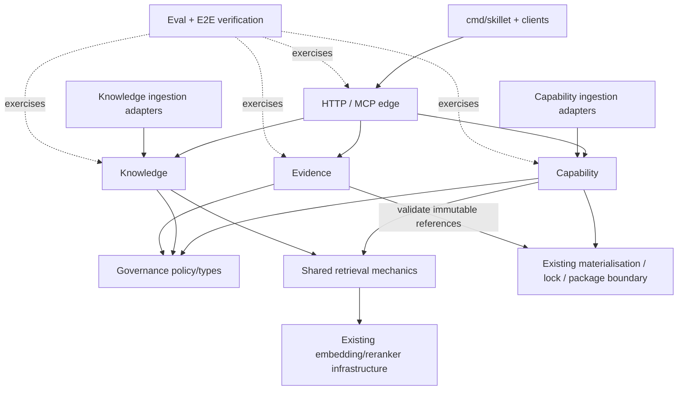

# ADR-013: vNext domain and module boundaries

## Status

Accepted for the vNext M1 architecture. This ADR is a documentation contract only: it does not change runtime behaviour, public APIs, storage, ranking, or materialisation semantics.

## Context

Skillet v1 is a focused skill registry: it discovers approved Agent Skills, indexes compact routing metadata, retains immutable packages, exposes discovery/materialisation over MCP, and records revision-bound lifecycle and feedback evidence.

The vNext roadmap broadens the product to cover agent capabilities and organisational knowledge while retaining the properties that make v1 safe and reproducible. Without explicit boundaries, that expansion risks collapsing skills, documents, tool metadata, governance state, execution, and feedback into one generic catalogue object or one generic search API. That would couple domains with different trust, retrieval, lifecycle, and disclosure semantics.

This ADR defines the ownership contract for issues #31-#40. It deliberately does not implement those issues.

## Decision

Skillet vNext remains **one Go product implemented as a modular monolith**. Domain boundaries are expressed with Go packages and internal interfaces inside the existing server, not as separately deployed services and not by composing Skilly, Raggle, or another registry/RAG product at runtime.

The architecture has five domain concepts with deliberately different meanings.

| Concept | Meaning | Owns | Does not own |
| --- | --- | --- | --- |
| **Capability** | Something an agent can use to perform work. M1 kinds include skills/playbooks backed by materialised content and MCP tool metadata used for discovery. | Stable capability identity, kind, compact discovery descriptor, task-intent retrieval, explicit describe/select linkage, capability provenance, scope-aware discovery. | Organisational documents, governance decisions, observed feedback, or tool execution. |
| **Knowledge** | Information an agent may need to understand work. M1 sources are Markdown and OKF documents. | Documents/chunks, information-need retrieval, source/freshness provenance, explicit links/backlinks, progressive read semantics. | Capability selection, package materialisation, generated final answers, or inferred authoritative graph relationships. |
| **Governance** | Policy metadata and rules controlling who owns something, where it is visible, and its catalogue lifecycle. | Organisation/namespace/repository scope values, ownership/maintainers, visibility, approval/searchability, active/deprecated/yanked state, transition rules, auditable reasons where persisted. | Semantic relevance, source authoring, evidence aggregation, or execution authorization. |
| **Evidence** | Observed lifecycle/feedback tied to immutable provenance, plus deterministic reviewable derivations from those observations. | Provenance validation, revision-bound lifecycle/feedback, grouping/deduplication, improvement candidates, evidence traceability. | Changing ranking, governance state, source files, lockfiles, or automatically creating fixes. |
| **Execution** | Actually invoking a tool, script, workflow, or other action to perform work. | Outside Skillet vNext M1. | Discovery, description, immutable package acquisition, or knowledge reading. Those remain Skillet responsibilities and are not execution. |

### Materialisation is not execution

The existing skill materialisation boundary remains part of capability acquisition/reproducibility. Skillet may prepare or serve an immutable package for an explicitly selected skill and the harness-neutral client may verify and place that package at an explicit destination. Skillet does **not** activate the skill, run its scripts, invoke a discovered MCP tool, or orchestrate a workflow.

ADR-001 and ADR-003 remain authoritative: package bytes stay outside ordinary MCP discovery results; exact commits and package digests remain lock boundaries; historical retained packages remain restorable.

## Domain separation

### Capability and knowledge are separate models

Capability and knowledge MUST NOT share one generic domain entity merely because both are searchable.

Capability search answers a task-routing question such as "what can help me do this?" It operates over compact descriptors and may consider capability kind, compatibility, trust, and scope subject to explicit evaluated rules.

Knowledge search answers an information question such as "what do I need to know about this?" It operates over document/chunk representations and returns snippets plus source/section provenance. Heading structure, document freshness, links, and chunk identity are knowledge concerns, not capability concerns.

The two domains therefore have:

- separate authoritative domain types;
- separate indexes or logically isolated index namespaces;
- separate retrieval fixtures, metrics, and thresholds;
- separate filtering and relevance policies;
- no cross-domain ranking that mixes a skill candidate and a document chunk into one ordered list in M1.

Knowledge content MUST NOT become capability routing text, and capability package bodies MUST NOT be indexed as knowledge merely because they contain Markdown.

### Shared retrieval mechanics, not a shared domain

Issue #33 may extract reusable retrieval mechanics behind internal Go interfaces/package-level composition. The intended shared boundary is `internal/retrieval` (or an equivalently narrow package) and may own mechanics such as:

- lexical retrieval;
- vector similarity;
- reciprocal-rank fusion;
- reranker application;
- deterministic tie-breaking;
- retrieval diagnostics/degraded-state reporting.

`internal/retrieval` MUST NOT own a universal `Item`, `Resource`, or `Document` domain model that replaces capability or knowledge types. Each domain maps its own retrieval projection into the shared mechanics and maps results back to its own result contract. The shared package must not import `internal/capability` or `internal/knowledge`.

## Target module ownership

The names below are target ownership boundaries, not a requirement to rename existing v1 packages in this issue. Existing packages such as `internal/search`, `internal/catalogue`, `internal/httpserver`, package storage/building, and lockfile handling remain in place until the roadmap issue that needs a change can migrate or wrap them safely.

| Boundary | Target package/area | Responsibilities |
| --- | --- | --- |
| Capability domain | `internal/capability` | Capability identity/kind, compact descriptor, scope-aware task-intent discovery, explicit describe/select semantics, skill/playbook/tool-metadata projections. |
| Knowledge domain | `internal/knowledge` | Markdown/OKF document and chunk models, information retrieval, read semantics, provenance/freshness, explicit links/backlinks. |
| Retrieval mechanics | `internal/retrieval` | Domain-neutral lexical/vector/RRF/rerank/tie-break mechanics and retrieval diagnostics only. |
| Governance | `internal/governance` | Namespace/ownership/visibility/lifecycle policy values and transitions. Domain services enforce the policy before presentation/ranking as appropriate. |
| Evidence | `internal/evidence` | Revision-bound lifecycle/feedback evidence and deterministic improvement-candidate derivation. |
| Materialisation/reproducibility | existing catalogue/package/lockfile boundaries | Immutable skill packages, commit/tree/archive digests, exact restoration, signed acquisition details. This remains a compatibility boundary rather than becoming a generic execution module. |
| Ingestion adapters | existing/new source-specific internal adapters | Convert Agent Skills, Markdown, OKF bundles, or MCP tool-catalogue snapshots into the owning domain model. They do not become canonical authoring systems. |
| Agent transport | existing `internal/httpserver`/MCP edge | Authenticate/authorize, validate bounded requests, translate MCP/HTTP contracts to domain/application calls, and serialize compact responses. It contains no ranking/domain policy that belongs in the modules above. |
| Verification | existing `internal/e2e`, `internal/eval`, CI/developer command | Cross-domain executable proof, regression baselines, deterministic fixtures, and machine-readable gate output. It is not a production domain. |

### Dependency direction

This is the target steady-state dependency graph, not an additional issue-ordering constraint. Until `internal/governance` exists, current auth/config/catalogue policy remains the compatibility implementation. In particular #34/#35 do not wait for #36/#38 and must not invent a second competing governance model merely to satisfy the target graph.

The important constraints are the arrow directions:

- capability and knowledge do not import one another;
- retrieval mechanics do not import either domain;
- transport does not become the owner of ranking or lifecycle rules;
- evidence validates immutable references against the existing materialisation/catalogue contract rather than introducing a second provenance authority;
- evidence may reference immutable capability provenance but capability discovery does not depend on evidence-derived quality/ranking in M1;
- governance state constrains visibility/lifecycle but does not derive semantic relevance;
- no production module depends on Skilly or Raggle.

## Scope model

Central and repository-local scope are first-class concepts, not naming conventions hidden in search text.

The scope hierarchy for M1 is:

1. organisation;
2. optional namespace/team;
3. optional repository context.

A centrally available capability has no repository-only visibility requirement. A repository-local capability is eligible only when the validated request scope permits that repository. Missing or forged repository context must never broaden visibility. Visibility filtering is an authorization/catalogue constraint and is applied independently of semantic relevance.

The same scope value types may be reused by knowledge when scoped knowledge is introduced, but reusing scope types does not merge capability and knowledge models or indexes.

Scope/control metadata SHOULD remain outside embedding/routing text unless a roadmap issue deliberately specifies, evaluates, and protects a relevance effect.

## Progressive disclosure invariant

Progressive disclosure is a product invariant across both retrieval domains.

For capabilities:

1. discovery returns a bounded compact descriptor sufficient to compare candidates;
2. a full skill package or full MCP input schema is not returned during ordinary search;
3. after explicit selection, a caller may request capability details;
4. package-backed capabilities may then use the existing explicit materialisation flow.

For knowledge:

1. search returns bounded snippets plus identity/section/source provenance;
2. full page/chunk content is read only after explicit selection;
3. backlinks expose explicit relationships only and do not enumerate or synthesize an organisation-wide graph into model context.

Progressive disclosure is both a context-efficiency and trust boundary. Adding a new capability kind or knowledge format must not bypass it.

## OKF boundary

Open Knowledge Format (OKF) is an **ingestion/interchange contract** for the knowledge domain.

Skillet may validate supported OKF bundles and map their documents, metadata, provenance, freshness, and explicit links into the knowledge model. Skillet core does not own:

- authoring OKF content;
- harvesting/inducing content from Confluence, Jira, Snowflake, or other source systems;
- an AWS-specific producer/runtime;
- automatic rewriting or publishing of source material.

Source-specific producers may exist as separate tools or repositories and send/produce deterministic OKF input. They are not runtime dependencies of the Skillet server.

## Governance boundary

Governance is explicit catalogue policy rather than implicit ranking metadata.

In M1 it covers the minimum required to answer:

- who owns/maintains this catalogue entry;
- which organisation/namespace/repository may see it;
- whether it is approved/searchable, active, deprecated, or yanked;
- what publisher-declared successor guidance exists;
- why a persisted lifecycle change occurred where an audit reason is required.

Governance decisions do not rewrite immutable historical revisions. `replaced_by` remains guidance and never silently substitutes materialisation or lock restoration. Lifecycle/feedback evidence does not automatically approve, deprecate, yank, or re-rank a capability.

Git repositories and pull requests remain the M1 contribution/review workflow. A marketplace workflow, proposal queue, SCIM/Entra reconciliation, and web admin UI are outside this boundary for M1.

## Evidence boundary

Evidence records what was observed, not what Skillet should autonomously do next.

A trustworthy evidence record is tied to immutable provenance sufficient to identify the exact relevant materialised revision/package. Derivations such as improvement candidates must retain references to the underlying evidence and be deterministic for deterministic inputs.

Evidence MAY summarize repeated friction, corrections, compatibility mismatches, workarounds, or effective patterns. It MUST NOT as a side effect:

- change search ranking;
- mutate governance state;
- modify source repositories or knowledge documents;
- alter lockfiles or package history;
- silently create issues/PRs;
- execute a proposed fix.

A deterministic handoff payload for an external human/agent workflow is data, not execution.

## Agent-facing MCP surface

The agent-facing MCP surface remains deliberately small and task-oriented.

Existing v1 skill tools remain compatible during M1. Roadmap issues may add narrowly scoped operations such as capability search/describe and knowledge search/read/backlinks, but they must preserve progressive disclosure and bounded results.

The MCP edge must not grow into a generic object CRUD API or a universal MCP proxy. In particular M1 exposes no generic `execute_capability`, dynamic tool-call broker, arbitrary workflow runner, source mutation operation, or "return the whole catalogue/wiki" operation.

Tool metadata may be discovered as a capability. Full normalized schema is disclosed only after explicit selection. Invocation remains the responsibility of the consuming agent/harness using its own configured tool connection and authorization.

## v1 compatibility and migration strategy

Migration is additive and issue-by-issue.

1. **Keep v1 contracts working.** `search_skills`, `list_skills`, skill materialisation, lifecycle/feedback APIs, package acquisition, and lock restoration remain compatible through vNext M1 unless a separately reviewed compatibility issue/ADR explicitly changes them.
2. **Extract mechanics before generalising domains.** #33 first moves reusable retrieval mechanics without changing protected skill-search behaviour.
3. **Add knowledge beside capability search.** #34/#35 create a separate knowledge model/index rather than stretching the skill model.
4. **Introduce capability as an internal generalisation.** #36 maps existing Agent Skills into the capability domain while retaining all commit/tree/package digest semantics and preserving the v1 skill API as a compatibility projection.
5. **Add capability kinds without adding execution.** #37 adds MCP tool metadata to discovery only.
6. **Centralise explicit governance policy.** #38 moves/introduces ownership/scope/lifecycle rules without rewriting historical package state.
7. **Build reviewable learning from evidence.** #39 derives candidates without coupling evidence to ranking/governance/source mutation.
8. **Remove compatibility only by separate decision.** No v1 API or storage guarantee is removed merely because the vNext equivalent exists.

Storage changes introduced by later issues should be additive where practical. Immutable package identities and historical lock restoration are not migration conveniences and must not be weakened to simplify a new domain model.

## Roadmap ownership

Every child of #30 has one primary architecture owner. Cross-cutting tests may exercise multiple modules, but product logic stays with its owner.

| Issue | Primary owner | Allowed cross-boundary work |
| --- | --- | --- |
| #31 architecture contract | `docs/adr` + handoff docs | Documentation only; no runtime change. |
| #32 verification/E2E/regression gate | `internal/e2e`, `internal/eval`, CI/developer verification entry point | Exercises all public/local boundaries; adds no product behaviour. |
| #33 reusable retrieval primitives | `internal/retrieval` | Existing capability/skill search adapts to the primitives with zero protected behaviour regression. |
| #34 Markdown knowledge vertical slice | `internal/knowledge` | Knowledge ingestion adapter + shared retrieval use; no capability changes except regression proof. |
| #35 OKF + knowledge MCP | `internal/knowledge` + OKF ingestion adapter | `internal/httpserver` only for bounded knowledge transport contracts. |
| #36 central/repository-local capability model | `internal/capability` | `internal/governance` supplies scope/visibility value types/rules; existing materialisation is bridged, not replaced. |
| #37 MCP tool metadata capabilities | `internal/capability` + tool-catalogue ingestion adapter | Transport may expose describe/search; no execution module is introduced. |
| #38 lightweight governance | `internal/governance` | Capability domain enforces discovery/materialisation presentation rules; audit/storage adapters persist state where required. |
| #39 evidence-backed improvement candidates | `internal/evidence` | Reads immutable capability provenance and exposes bounded maintainer-facing transport; no ranking/governance/source mutation. |
| #40 integrated M1 acceptance | verification/integration boundary | Integrates already-owned features; any missing new product capability becomes a separate issue rather than new #40 scope. |

When a proposed feature is ambiguous, classify it by the question it answers:

- **"What can help perform this task?"** -> capability.
- **"What information explains this task/domain?"** -> knowledge.
- **"Who owns/can see/is this approved or active?"** -> governance.
- **"What happened when an immutable revision was used, and what reviewable signal follows?"** -> evidence.
- **"Please call/run/do the action now."** -> execution, outside M1.

If a feature answers more than one question, split orchestration/transport from the domain decisions rather than creating a shared catch-all entity.

## Explicit invariants

The following are architecture invariants for vNext M1:

1. The production server remains a single Go modular monolith.
2. Capability and knowledge have separate authoritative models and retrieval semantics.
3. Shared retrieval code contains mechanics only and does not become the canonical domain model.
4. Progressive disclosure is preserved for capability and knowledge retrieval.
5. Capability/package materialisation remains explicit; commit/tree/archive provenance and digest-verified reproducibility remain intact.
6. Historical locked restoration never silently follows newer versions, deprecation, or successor metadata.
7. Search/retrieval never silently executes, installs, substitutes, upgrades, rewrites, or mutates canonical source.
8. Central and repository-local scope is explicit data/policy and cannot be broadened by missing/forged context.
9. Governance/control metadata affects visibility/lifecycle according to explicit rules and does not accidentally become semantic relevance text.
10. Evidence remains traceable to immutable provenance and cannot autonomously change ranking, governance, or source.
11. OKF is an ingestion/interchange boundary, not Skillet's canonical authoring/harvesting system.
12. The agent-facing MCP surface remains bounded and contains no dynamic execution broker.
13. v1 public contracts remain compatible until a separately reviewed migration decision removes them.
14. Skilly and Raggle are prior art only; they are not runtime dependencies. Production implementation remains Go-only.

## Deferred scope

The following are explicitly outside vNext M1 unless the roadmap is separately amended:

- dynamic MCP tool execution/brokering or delegated execution credentials;
- arbitrary workflow orchestration or automatic capability composition/dependency execution;
- web marketplace/admin UI;
- SCIM or Entra-specific lifecycle/group reconciliation;
- generated final RAG answers;
- automatic source/document/skill mutation;
- automatic issue/PR creation from evidence;
- direct Confluence/Jira/Snowflake harvesting inside Skillet core;
- inferred graph authority or graph ranking beyond explicit source links/backlinks;
- a unified capability + knowledge result ranking;
- autonomous governance decisions.

## Consequences

This architecture accepts some duplication between capability and knowledge models in exchange for clearer semantics, safer evolution, and independently measurable retrieval quality. Shared retrieval mechanics can still remove algorithmic duplication without erasing domain boundaries.

The modular-monolith choice keeps deployment and local-first operation simple while giving later issues enforceable package ownership. If scale or operational evidence eventually justifies service separation, the domain boundaries in this ADR provide seams for that future decision; M1 does not pre-emptively pay the distributed-systems cost.

The compatibility strategy makes vNext incremental: new knowledge/capability functionality can be proven behind the existing product without weakening v1 reproducibility or forcing clients to migrate before the replacement contracts are demonstrated end to end.
